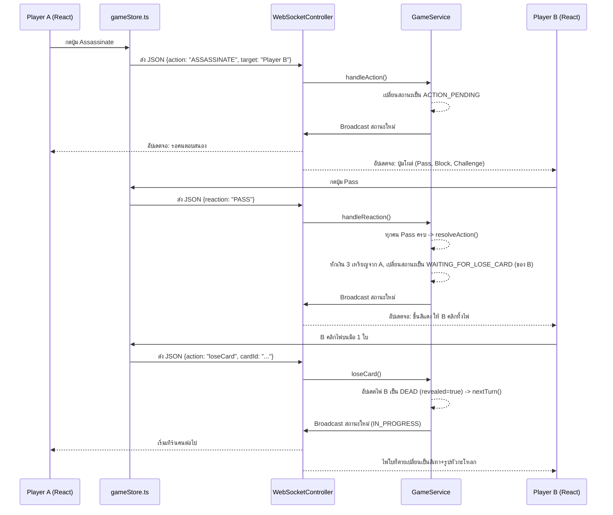

# 🏰 Fantasy Coup - โครงสร้างและการทำงานของระบบ (Architecture & Control Flow)

เอกสารนี้อธิบายสถาปัตยกรรมและการไหลของข้อมูล (Control Flow) ของโปรเจกต์เกม Fantasy Coup ซึ่งแยกเป็นระบบ **Frontend (React)** และ **Backend (Spring Boot + WebSocket)**

---

## 🏗️ 1. ภาพรวมสถาปัตยกรรม (Architecture Overview)

ระบบใช้ **Client-Server Architecture** โดยมี WebSocket เป็นหัวใจหลักในการสื่อสารแบบ Real-time (ผู้เล่นทุกคนเห็นการเปลี่ยนแปลงพร้อมกัน) แต่ในขณะเดียวกันก็ใช้ REST API สำรองไว้สำหรับการดึงข้อมูลที่เป็นความลับ (เช่น ไพ่ในมือตัวเอง) เพื่อไม่ให้ข้อมูลรั่วไหลไปกับ WebSocket Broadcast

```mermaid
graph TD
    Client1[Player 1 Browser] <-->|WebSocket (STOMP)| WS[GameWebSocketController]
    Client2[Player 2 Browser] <-->|WebSocket (STOMP)| WS
    Client1 -->|REST (GET)| Rest[PlayerController]
    
    WS --> GS[GameService]
    Rest --> GS
    
    GS --> Domain[Game Domain (Memory)]
    GS -->|Broadcast State| WS
```

---

## 🌐 2. Frontend (React + Zustand + Tailwind)

โค้ดหน้าบ้านถูกจัดระเบียบในโฟลเดอร์ `frontend/src/` โดยใช้ **Zustand** เป็น State Management ตรงกลางเพื่อให้ทุก Component คุยกันง่ายขึ้น

### 📂 ไฟล์หลักๆ และหน้าที่
1. **`App.tsx`**
   - จัดการ Routing (`/` หน้าแรก, `/lobby` หน้าห้องรอ, `/game/:gameId` หน้าเล่นเกม)
   - มีระบบ `ConnectionRestorer` คอยเช็คว่าถ้าผู้เล่น Refresh หน้าเว็บ ให้พยายามต่อ WebSocket กลับเข้าห้องเดิมอัตโนมัติ

2. **`store/gameStore.ts`** (สมองของ Frontend)
   - เก็บข้อมูล State ปัจจุบันทั้งหมด (ใครมีเงินเท่าไหร่, เทิร์นใคร, ข้อมูลการกระทำที่รออยู่)
   - ฟังก์ชันหลักที่ Component เรียกใช้:
     - `connect()`: เชื่อมต่อ STOMP WebSocket
     - `joinGame()`: ส่งคำสั่งเข้าห้องและ **Subscribe** รับข้อมูลห้องจาก `/topic/game/{gameId}`
     - `takeAction()`: ส่งคำสั่งทำ Action ไปให้ Server (เช่น ขอ Income, ขอ Coup)
     - `reactToAction()`: ส่งคำสั่งตอบสนอง (PASS, BLOCK, CHALLENGE)
     - `fetchMyHand()`: ส่ง Request แบบ REST API ไปดึงไพ่ของตัวเองเท่านั้น

3. **`pages/Game.tsx`** (หน้าจอตอนเล่น)
   - **Render ตาม State:** หน้าจอจะเปลี่ยนไปตามค่า `gameStatus` (เช่น `IN_PROGRESS`, `ACTION_PENDING`, `WAITING_FOR_LOSE_CARD`)
   - การคลิกไพ่ทิ้ง หรือการกดใช้สกิล จะไปเรียกฟังก์ชันใน `gameStore.ts` ทั้งหมด

---

## ⚙️ 3. Backend (Spring Boot + Java)

ระบบหลังบ้านใช้ Spring Boot โดยออกแบบโครงสร้างเป็น **Layered Architecture** ซ่อนลอจิกไว้ใน Service และใช้ Controller เป็นแค่ประตูกระจายข่าว

### 📂 ไฟล์หลักๆ และหน้าที่

#### 🚪 Controller Layer (รับ-ส่งข้อมูล)
1. **`GameWebSocketController.java`**
   - รับคำสั่งผ่าน STOMP (เช่น `@MessageMapping("/game.action")`)
   - เรียกใช้งาน `GameService` เพื่อประมวลผล
   - จบด้วยการเรียกฟังก์ชัน `broadcastGameState(gameId)` เพื่อส่ง State ใหม่ล่าสุด ไปให้ **ผู้เล่นทุกคนในห้อง** ผ่าน `/topic/game/{gameId}`
2. **`PlayerController.java`**
   - เป็น REST API (`@GetMapping("/api/game/{gameId}/player/{playerName}/hand")`) ให้ผู้เล่นแอบมาขอดูไพ่ตัวเองโดยเฉพาะ ป้องกันไม่ให้ส่งไพ่ทุกคนไปใน Broadcast

#### 🧠 Service Layer (ลอจิกเกมหลัก)
1. **`GameService.java`** 
   - จัดการคลาส `Game` ทั้งหมด (เก็บไว้ใน `ConcurrentHashMap` ในหน่วยความจำชั่วคราว)
   - ฟังก์ชันหลักที่มีการหมุนเวียนลอจิก:
     - `handleAction(...)`: ตรวจสอบและหักเงินเบื้องต้น (เช่น Coup หัก 7 ทันที) จากนั้นเปลี่ยนสถานะเกมเป็น `ACTION_PENDING` (รอคนอื่นตอบสนอง)
     - `handleReaction(...)`: รับผลการกด PASS/BLOCK/CHALLENGE ถ้าคนกด PASS ครบวง จะเรียก `resolveAction()`
     - `resolveAction(...)`: คำสั่งศักดิ์สิทธิ์ที่ทำงานเมื่อเคลียร์ข้อครหาสำเร็จ เช่น หักเงิน Assassinate เพิ่มไพ่ Merchant แจกเงิน ฯลฯ
     - `loseCard(...)` / `returnCards(...)`: จัดการตอนผู้เล่นเลือกไพ่ทิ้ง

#### 🎲 Domain Layer (โครงสร้างข้อมูล)
- **`Game.java`**: เก็บข้อมูลผู้เล่นทั้งหมด กองไพ่กลาง (`deck`) และสถานะของเกมปัจจุบัน (`status`)
- **`Player.java`**: เก็บชื่อ เงิน ไพ่ในมือ และสถานะ (ยังมีชีวิตไหม)
- **`Card.java`**: เก็บ ID, Role (บทบาท) และ Revealed (ถูกเปิด/ตายแล้วหรือยัง)
- **`PendingAction.java`**: เก็บร่องรอยของการกระทำที่ยังไม่จบ (เช่น A กำลังจะฆ่า B, มีคน Block หรือยัง, มีคน Pass กี่คนแล้ว)

---

## 🔄 4. ลำดับการทำงาน (Control Flow) ของ 1 สกิล

มาดูตัวอย่างเมื่อ **Player A สั่ง Assassinate ใส่ Player B**:



---

## 💡 สรุปกลไกสำคัญ
1. **การรอการตัดสินใจ:** ทุกสกิลที่มีผลกระทบกับคนอื่นจะไม่ทำงานทันที แต่จะเข้าไปติดอยู่ที่ `ACTION_PENDING` หรือ `BLOCK_PENDING` เสมอ จนกว่า `passedPlayers` จะครบจำนวนคนในวง
2. **ความปลอดภัยของไพ่:** WebSocket ไม่เคยแอบส่งไพ่หน้าคว่ำของใครไปให้คนอื่น ทุกคนจะได้เห็นแค่จำนวนไพ่ (`cardCount`) แต่ตัวเกมจะส่งคำสั่ง `fetchMyHand()` แยกต่างหากเพื่อไปดึงรูปไพ่ของตัวเองมาโชว์
